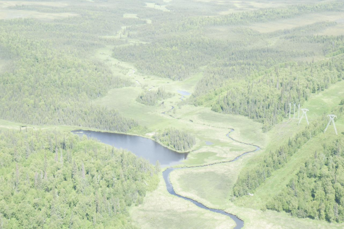
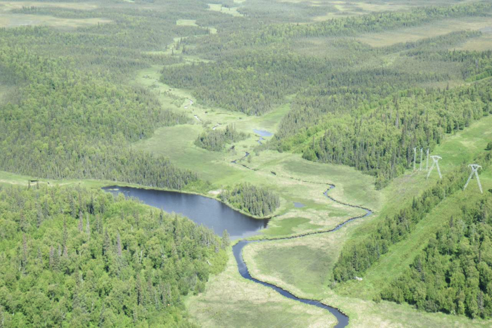
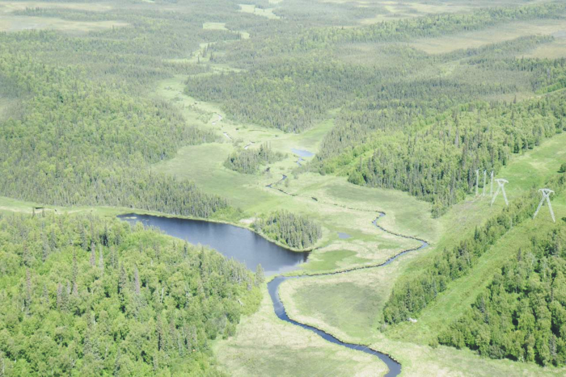
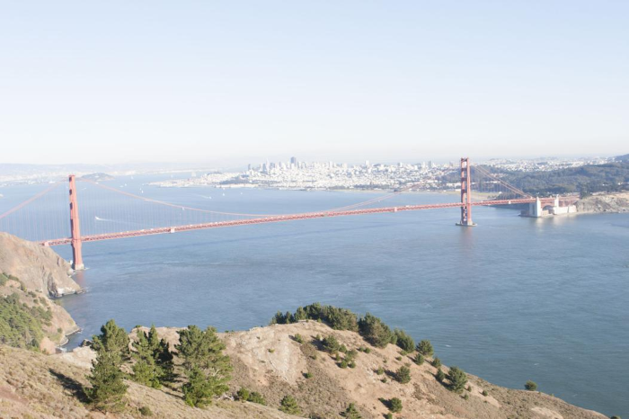
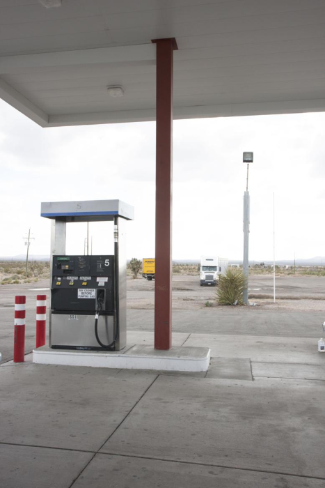
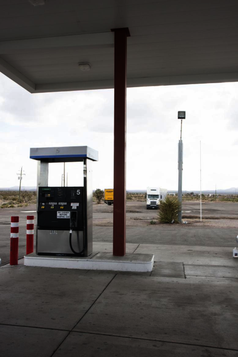
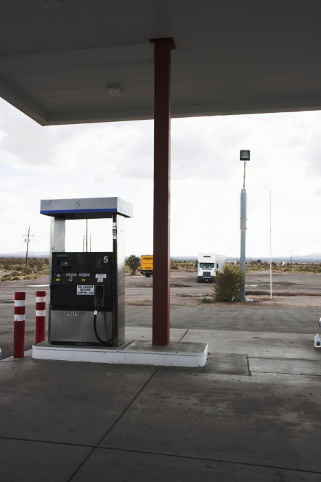

# Stochastic Gamma Correction Hardware Accelerator

This project implements a hardware accelerator that uses stochastic computing (SC) to apply gamma correction to overexposed images. By replacing traditional, area-heavy binary multipliers with pseudo-random bitstreams, this design trades computational time for lower footprint & less LUTs.


_Figure 1: Galois Linear Feedback Shift Register (LFSR) used for pseudo-random probability generation. [3]_


_Figure 2: Routed physical layout (Device View) of the stochastic accelerator on the target FPGA from Vivado._

Human eyes perceive light in a non-linear way, so gamma correction uses the power-law formula $V_{out} = V_{in}^\gamma$ 
(where pixel values are normalized between 0 and 1). To simplify hardware implementation, we use a gamma value of 2 ($\gamma = 2$). 
This effectively means each computation is just squaring the fractional value, decreasing the overall brightness and bringing 
color depth back to washed-out images.

```
+-------------------------------------------------------------------------+
|                         TESTBENCH (tb_gamma_top)                        |
|                                                                         |
|   +-----------------------------------------------------------------+   |
|   |                       Image Data Register                       |   |
|   |                  (Loaded from input_image.hex)                  |   |
|   +--------+------------------------+------------------------+------+   |
|            | 8-bit R Data           | 8-bit G Data           | 8-bit B  |
|            v                        v                        v          |
| +---------------------------------------------------------------------+ |
| |                 STOCHASTIC ENGINE HARDWARE (gamma_top)              | |
| |                                                                     | |
| |                  +---------------------------+                      | |
| |                  |     8-bit Galois LFSR     |                      | |
| |                  +-------------+-------------+                      | |
| |                     8-bit Rand |                                    | |
| |    +---------------------------+---------------------------+        | |
| |    |                           |                           |        | |
| |    v                           v                           v        | |
| | +--+---+                   +---+--+                    +---+--+     | |
| | | SNG 0|                   | SNG 1|                    | SNG 2|     | |
| | | (Red)|                   | (Grn)|                    | (Blu)|     | |
| | +--+---+                   +---+--+                    +---+--+     | |
| |    |                           |                           |        | |
| |    | 1-bit                     | 1-bit                     | 1-bit  | |
| |    v stream                    v stream                    v stream | |
| | +--+---------------------------+---------------------------+------+ | |
| | |               AND Gates & 256-Cycle Accumulators                | | |
| | +--------+------------------------+------------------------+------+ | |
| |          |                        |                        |        | |
| +----------|------------------------|------------------------|--------+ |
|            v 8-bit Out              v 8-bit Out              v 8-bit  | |
|   +--------+------------------------+------------------------+------+   |
|   |                         File I/O Write                          |   |
|   |                 (Saved to output_image.hex)                     |   |
|   +-----------------------------------------------------------------+   |
+-------------------------------------------------------------------------+

```
| Input | Baseline | SC |
|:---:|:---:|:---:|
|  |  |  |
|  |  |  |
|  |  |  |

*Input images: MIT-Adobe FiveK [1], images a0333, a0934, a0303, obtained via the Kaggle mirror [2].*

## References

[1] V. Bychkovsky, S. Paris, E. Chan, F. Durand. "Learning Photographic Global Tonal
Adjustment with a Database of Input/Output Image Pairs." *CVPR*, 2011.
https://data.csail.mit.edu/graphics/fivek/

[2] aasifkhanm. "Image_Exposure_Dataset." Kaggle, 2024.
https://www.kaggle.com/datasets/aasifkhanm/image-exposure-dataset

[3] moria.us. "Demystifying the LFSR." Feb. 13, 2022. <article URL>
